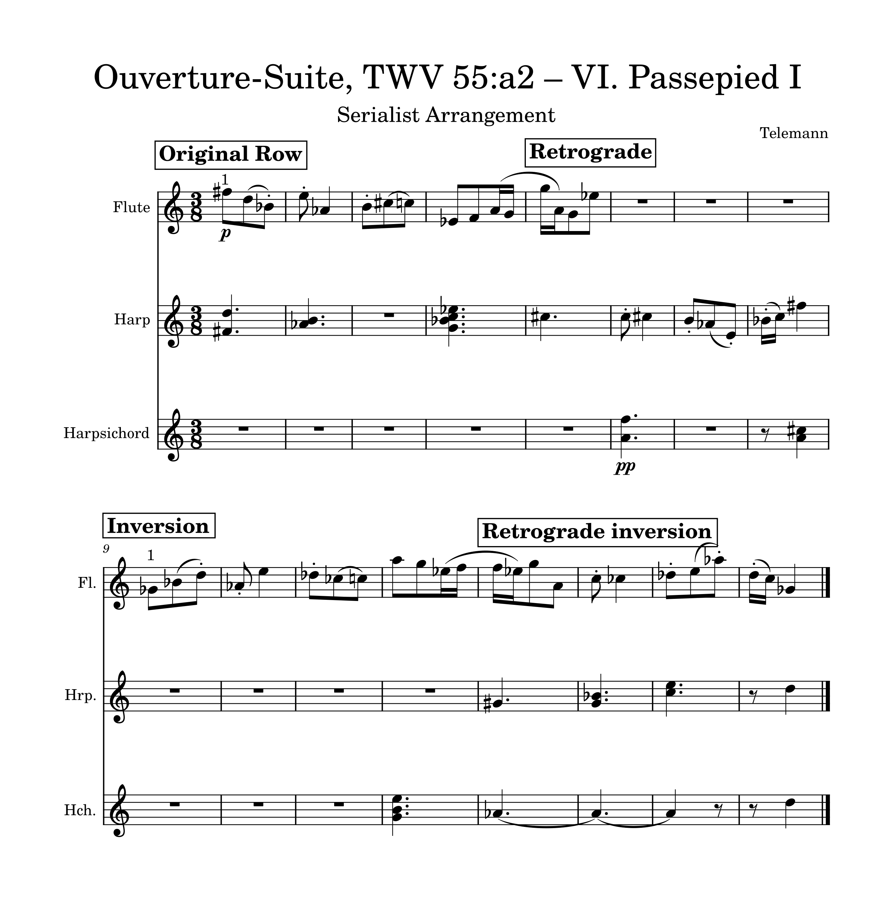
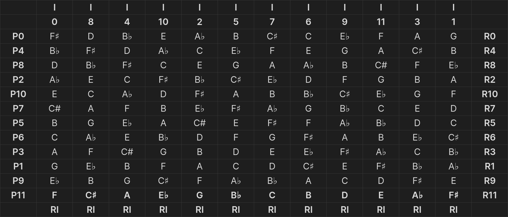

<audio controls style="width: 70%; display: block; margin: 7vw auto 0;">
    <source src="../assets/compositions/twelve-tone-composition.mp3" type="audio/mpeg">
    Your browser does not support the audio element.
</audio>

<h2>My creation process</h2>

A few weeks previously we had begun learning about twelve-tone pieces. We had previously examined some of the works of Arnold Schoenberg and worked on writing out serialism matrices in order to develop an idea of how twelve-tone works were composed. When we were assigned the task of composing in the style of Schoenberg, I was both nervous and excited.

To start out, I chose to take an existing piece and rearrange it. I used "Ouverture-Suite, TWV 55:a2 — VI. Passepied I" by Georg Philipp Telemann. After having created the matrix, my opening step was to conserve the note durations but rearrange them using the twelve-tone matrix. The original work is written for flute, but I thought it would be really fun to arrange it with some other instruments in order to have a pointillism, which is where you have little isolated notes building the overall picture.

I began by writing out the original tone row, then composing various versions of it: the retrograde (which is the row reversed), the inverted (which reverses the intervals), and the retrograde-inverted (which is both combined). Next, I chose tone rows from within my matrix and placed them surrounding the main row in a manner that I felt sounded best. This was certainly the most difficult part for me, but it was also the most fulfilling. Overall, doing all of this was helpful in allowing me to learn much about twelve-tone music and how to write in its style.

