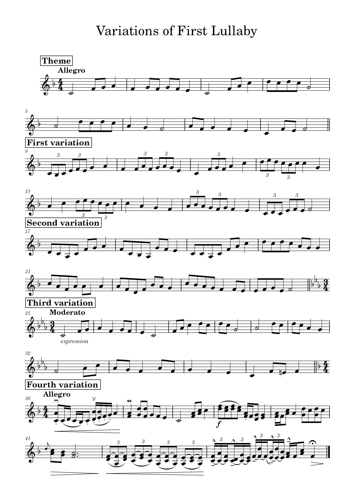

	

        

            
            <audio controls style="width: 100%; margin-bottom: 180px;">
                <source src="assets/compositions/theme_and_variations.mp3" type="audio/mpeg">
                Your browser does not support the audio tag.
            </audio>
        

	

	

		<h3 style="margin-top: 110px; margin-bottom: 0px;">Theme</h3>
        <audio controls style="width: 100%;">
                <source src="assets/compositions/theme.mp3" type="audio/mpeg">
                Your browser does not support the audio tag.
            </audio>
        
My theme is just my first lullaby.

		<h3 style="margin-top: 65px; margin-bottom: 0px;">First Variaton</h3>
        <audio controls style="width: 100%;">
                <source src="assets/compositions/first_variation.mp3" type="audio/mpeg">
                Your browser does not support the audio tag.
            </audio>
        
Triplets.

		<h3 style="margin-top: 60px; margin-bottom: 0px;">Second Variation</h3>
        <audio controls style="width: 100%;">
                <source src="assets/compositions/second_variation.mp3" type="audio/mpeg">
                Your browser does not support the audio tag.
            </audio>
        
Eighth notes.

		<h3 style="margin-top: 55px; margin-bottom: 0px;">Third Variation</h3>
        <audio controls style="width: 100%;">
                <source src="assets/compositions/third_variation.mp3" type="audio/mpeg">
                Your browser does not support the audio tag.
            </audio>
        
Here I tried for a slightly sad variation.

		<h3 style="margin-top: 70px; margin-bottom: 0px;">Fourth Variation</h3>
        <audio controls style="width: 100%;">
                <source src="assets/compositions/fourth_variation.mp3" type="audio/mpeg">
                Your browser does not support the audio tag.
            </audio>
        
---

	

